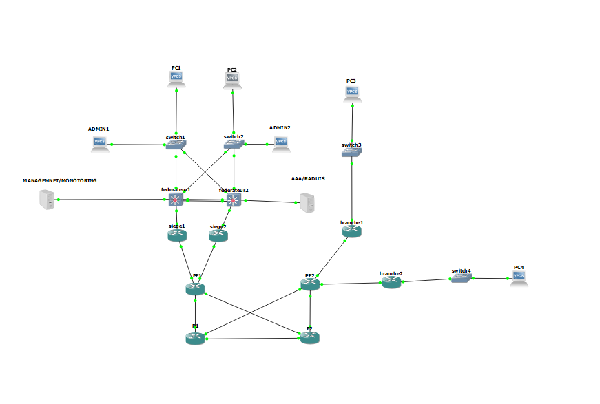

# Projet MPLS VPN – Conception d’un backbone sécurisé

**Auteurs :**  
- Fayrouz Jbeli  
- Wajid Hamdi  
- Yossri Hamdouni  

**Encadrant :** Brrani.Nour 

---

## Architecture finale

*Schéma complet du projet (backbone MPLS, sites clients, fédérateurs, switchs, serveurs, postes administrateurs).*

---

## Organisation du dépôt

- `cahier_de_charge.pdf` – le cahier des charges officiel.
- `rapport_projet.pdf` – le rapport détaillé (contient toutes les configurations, captures d’écran et justifications).
- `architecture_finale.png` – image de la topologie globale.

Toutes les configurations des équipements (routeurs, switchs, serveurs) sont intégrées dans le rapport. Aucun fichier de configuration séparé n’est fourni.

---

## Détail des trois parties avec justification des outils

### 1. Backbone MPLS et VPN

| Outil / Protocole | Pourquoi est‑il utilisé ? |
|------------------|---------------------------|
| **OSPF (Area 0)** | Routage dynamique interne au backbone. Permet une convergence rapide et une mise à jour automatique des routes en cas de changement de topologie. |
| **MPLS (Multi‑Protocol Label Switching)** | Évite de recalculer la route à chaque saut ; le paquet est commuté via des labels, ce qui accélère le forwarding. |
| **LDP (Label Distribution Protocol)** | Distribue les labels MPLS entre les routeurs voisins. Indispensable pour établir les LSP (Label Switched Paths). |
| **VRF (VPN Routing and Forwarding)** | Isole la table de routage du client `VPN_SECURITY` de la table globale. Permet l’overlap d’adresses entre clients. |
| **MP‑BGP (VPNv4)** | Transporte les routes VPN d’un PE à l’autre en associant RD (Route Distinguisher) et RT (Route Target). Essentiel pour le VPN MPLS Layer‑3. |
| **Redistribution OSPF ↔ BGP** | Permet d’injecter les routes des sites clients (apprises par OSPF) dans BGP, et inversement, afin que tous les sites se connaissent. |

**Pourquoi cette partie est essentielle ?**  
C’est le cœur du réseau. Sans MPLS VPN, chaque site serait isolé ou nécessiterait des tunnels IPsec complexes. MPLS VPN garantit l’isolation, la scalabilité et la performance.

### 2. Site Siège et Branches (LAN et redondance)

| Outil / Protocole | Pourquoi est‑il utilisé ? |
|------------------|---------------------------|
| **VLAN** | Segmente le trafic (DATA1, DATA2, Management, Inter-Fed). Améliore la sécurité et réduit les collisions/broadcasts. |
| **EtherChannel (LACP)** | Agrège plusieurs liens physiques entre les fédérateurs. Augmente la bande passante (2 Gbit/s) et offre une redondance : si un câble tombe, l’autre continue. |
| **HSRP** | Fournit une passerelle par défaut redondante (IP virtuelle partagée). Si le fédérateur actif tombe en panne, le standby prend le relais sans que les hôtes aient à modifier leur configuration. |
| **DHCP** | Automatise l’attribution des adresses IP aux PC des utilisateurs. Réduit les erreurs de configuration manuelle. |
| **Routage inter‑VLAN** | Permet aux hôtes de VLAN différents (ex. DATA1 et DATA2) de communiquer entre eux via le fédérateur. |

**Pourquoi cette partie est essentielle ?**  
Elle apporte la **haute disponibilité** (EtherChannel, HSRP) et la **flexibilité** (VLAN, DHCP). Sans elle, le réseau local serait lent, non segmenté et sujet à des pannes de passerelle.

### 3. AAA, Monitoring et Sécurité

| Outil / Protocole | Pourquoi est‑il utilisé ? |
|------------------|---------------------------|
| **AAA (RADIUS + local)** | Centralise l’authentification (RADIUS) et fournit un fallback local. Permet de gérer les accès (login, enable) avec des privilèges (1,10,15). |
| **ACL étendue** | Restreint l’accès aux lignes VTY aux seules IP des administrateurs (ADMIN1 et ADMIN2). Bloque les tentatives non autorisées. |
| **SNMP (communauté `SSIR`, traps)** | Permet la supervision à distance (Zabbix) : collecte d’informations (CPU, mémoire, interfaces) et envoi d’alertes (linkdown, etc.). |
| **Syslog (logging)** | Envoie les événements système (changements de configuration, pannes, etc.) vers un serveur central (Zabbix) pour archivage et analyse. |
| **NTP** | Synchronise les horloges de tous les équipements. Indispensable pour corréler les logs et les mesures IP SLA. |
| **IP SLA (icmp‑echo / udp‑jitter)** | Mesure la latence, la gigue et la perte de paquets entre les sites (CE12/CE22 vers CE11/CE21). Permet de vérifier la QoS. |
| **Zabbix** | Solution de supervision open‑source. Collecte les données SNMP, syslog, IP SLA, affiche des graphiques et envoie des alertes. |

**Pourquoi cette partie est essentielle ?**  
Elle **sécurise** l’infrastructure (AAA, ACL), **centralise la supervision** (Zabbix, SNMP, logging) et **garantit la qualité de service** (IP SLA). Sans elle, le réseau serait aveugle et vulnérable.

---

## Validation

Toutes les fonctionnalités ont été testées dans GNS3 (pings inter‑sites, redondance HSRP, authentification AAA, collecte SNMP, etc.). Les captures d’écran et les détails des tests sont disponibles dans le **rapport** (`rapport_projet.pdf`).

---

## Documents

- [Cahier des charges](cahier_de_charge.pdf)
- [Rapport complet](rapport_projet.pdf)

---

*Projet réalisé dans le cadre du cours SSIR – 2026*
